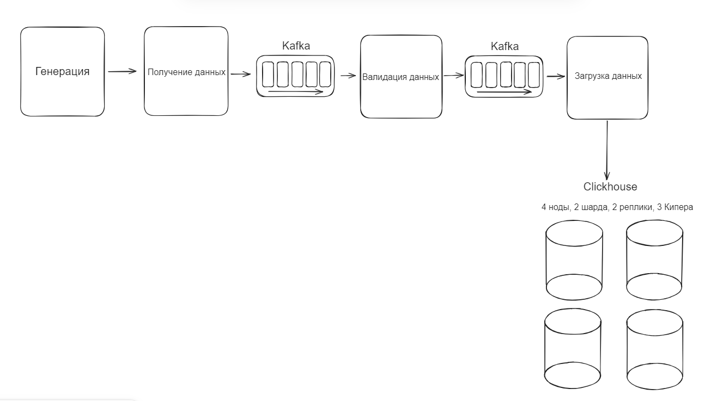
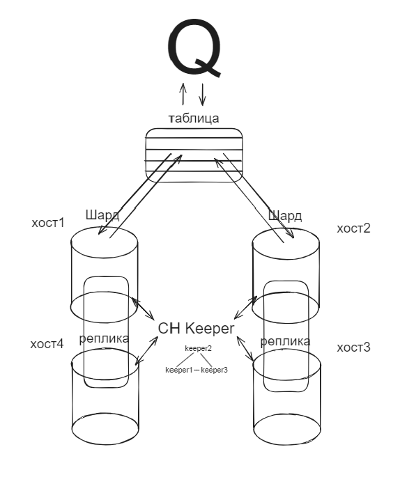

# Применение мониторинга для микросервисной архитектуры
**Инфраструктура представляет из себя:**
- Сервис поучения данных (REST API);
- Сервис валидации данных;
- Очередь сообщений (Kafka);
- Сервис загрузки данных в кластер (ClickHouse).

**Кластер Clickhouse представляет из себя:**
- 4 ноды кластера;
- 3 keeper для менеджмента кластера;
- 2 БД репликации;
- 2 шарда для разделения вычислений между нодами.

**Для мониторинга используются:**
- Prometheus;
- Grafana.

**TODO:**
- Конфигурация мониторинга
- Конфигурация кластера
- Конфигурация сервисов